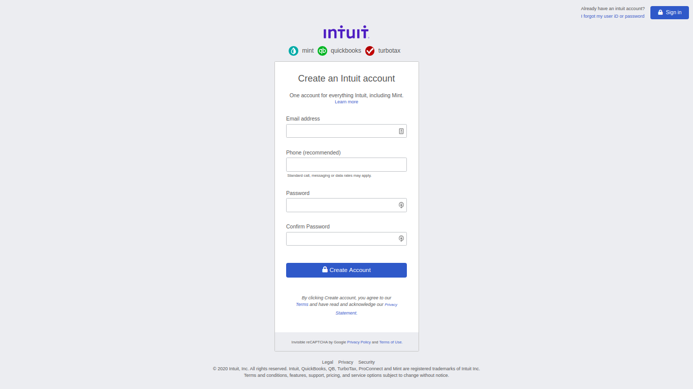

# HTML Forms

> HTML form sign up page that matches the appearance of mint.com’s signup page

## Built With

- HTML5
- CSS3

## Live Demo

[Live Demo Link](https://rawcdn.githack.com/bini-i/HTML-Forms/977088368300fc6c6b03293181df8a6b9e966469/index.html)

## Authors

👤 **Binyam Hailemeskel**

- GitHub: [@bini-i](https://github.com/bini-i)
- Twitter: [@binyamshewa](https://twitter.com/binyamshewa)
- LinkedIn: [LinkedIn](https://www.linkedin.com/in/binyam-hailemeskel-728048151/)

👤 **Oluwadare Juwon Joshua**

- GitHub: [@wintan1418](https://github.com/wintan1418)
- Twitter: [@juwonoluwadare](https://twitter.com/oluwadarejuwon)
- LinkedIn: [LinkedIn](https://www.linkedin.com/in/oluwadare-juwon-048a391a8/)

## 🤝 Contributing

Contributions, issues, and feature requests are welcome!

Feel free to check the [issues page](issues/).

## Show your support

Give a ⭐️ if you like this project!

## Acknowledgments

- mint.com

## 📝 License

This project is [MIT](lic.url) licensed.
